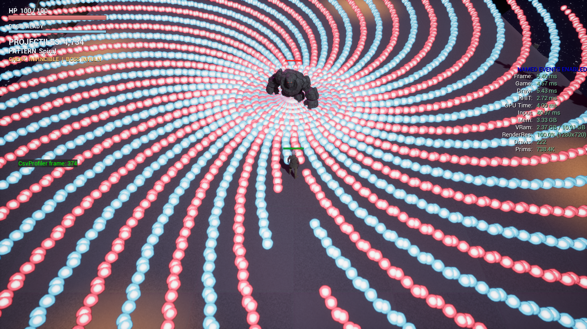

# Project_RE — UE5 대규모 탄막 보스전

> UE5 **Mass Entity** 로 투사체 **45,000발을 60fps** 에 유지하고,
> **데디케이티드 서버**에서 N명이 같은 탄막을 보게 만든 탑뷰 보스전.
> 모든 아키텍처 선택을 실측으로 정당화했고, **측정 도구가 거짓말한 사례를 문서로 남겼다.**



---

## 이 프로젝트가 주장하는 것

게임 완성도가 아니다. 축은 세 개다.

1. **대규모 투사체 시뮬레이션의 아키텍처 선택과 그 근거** — Mass(ECS) vs Actor 를 숫자로 가름
2. **서버 권위 하에서 수천 발을 복제 없이 동기화하는 설계** — 탄이 아니라 "탄을 만드는 법"을 보낸다
3. **측정을 믿지 않는 태도** — 초록불이 거짓말한 사례와 그걸 잡은 방법

보스 1종·승패 2상태가 전부인 것은 의도적이다. **측정 대상을 고정하기 위해서**다.

---

## 1. Mass vs Actor — 숫자

동일 5,000발, 1280×720, 720프레임 정상상태 캡처 ([근거](docs/profiling/M6-gpu-breakdown.md)):

|  | Mass (ISM) | Actor | 배수 |
|---|---:|---:|---:|
| GameThread mean | **4.03 ms** | 16.99 ms | 4.2× |
| DrawCalls | **96** | 3,358 | 35× |

스케일 곡선이 핵심이다:

```
탄환 수 →      100     1000     5000
Mass GT        2.71     3.17     4.03     ← 거의 평평
Actor GT       2.84     5.22    16.99     ← 선형 붕괴
```

탄이 50배 늘 때 Mass 는 게임 스레드가 1.3ms 오르고, Actor 는 14.2ms 오른다.
Actor 5,000 은 프레임이 GT 에 완전히 묶인다(GT 16.99 ≈ Frame).

**프로세서 3분해** — 스레드 배치가 CSV 컬럼 이름에 박혀 있다:

| 프로세서 | 스레드 | mean | p99 |
|---|---|---:|---:|
| `BulletSim` (이동) | **워커** | 0.04 | 0.08 |
| `BulletRender` (ISM 갱신) | 게임 | 0.74 | 1.33 |
| `BulletHit` (판정) | 게임 | 0.10 | 0.23 |

렌더 프로세서가 게임 스레드인 이유: ISM 은 씬 컴포넌트라 트랜스폼 갱신이 게임 스레드 전용이다
(`bRequiresGameThreadExecution=true`). 안 걸면 워커 스레드에서 크래시한다.
**이 제약이 곧 남은 병목의 위치를 정한다.**

**60fps 투사체 상한 45,000발.** 이력: 30,000 → 50,000(#95 그림자 제거 + 배치 API)
→ 45,000(#98 Niagara 플러그인 고정비 +2.5ms). 되돌릴 수 있는 교환임을 알고 받아들였다.

---

## 2. 데디케이티드 서버 — 탄을 복제하지 않는다

Mass 엔티티는 복제되지 않고, 복제해서도 안 된다 — 수천 발이다.

```
서버: 보스 발사 → Multicast RPC "패턴 P, 원점 O, 각도 A, 개수 N, 발사시각 T"
                → 서버 로컬 스폰 → 서버가 판정 (권위)
클라: RPC 수신 → 같은 파라미터로 로컬 스폰 → 클라가 그린다 (코스메틱)
```

**보내는 건 총알이 아니라 "총알을 만드는 법"이다.** 수천 발이 파라미터 몇 개로 압축된다.

설계 논점 세 개 ([해설](docs/guides/M5-정리.md)):

- **시드만으로는 안 된다.** 시드가 결정하는 건 페이즈 순서뿐이고, Fan 중심각·Artillery 착지점은
  *그 순간 플레이어 위치*에 달렸다. 그래서 시드가 아니라 **계산된 발사 파라미터 자체**를 보낸다.
- **발사 시각을 같이 보낸다.** 클라는 RPC 를 늦게 받는다. `StartTime` 이 있으면
  "이 탄은 이미 0.08초 날아간 상태"로 스폰한다.
- **유도할 수 있는 건 안 보낸다.** 탄 색 교차·로브 위상·링 회전 위상은 전부 `ServerTime` 에서
  순수 유도한다. 카운터를 따로 두면 멀티캐스트 유실 시 클라마다 어긋난다.

판정은 클라에서도 돌린다(`AllNetModes`) — 클라가 자기 시뮬로 탄을 지우고 폭발을 띄운다.
**데미지만 `HasAuthority()` 가드로 서버에 남는다.**

---

## 3. 측정이 거짓말한 여섯 번

"성능을 쟀다"는 흔하다. **"잰 값을 의심해서 도구부터 고쳤다"** 는 드물다.

| # | 거짓말한 방법 | 어떻게 잡았나 |
|---|---|---|
| #88 | 캡처가 **엔진 부팅 시점**에 시작 — 17.9초 창 중 13.3초가 레벨 로드·셰이더 컴파일 | `-csvStartOnEvent` 로 정상상태 진입 후부터만 캡처 |
| #88 | 클로즈드루프 스폰이 **리밋사이클**(400~1,800 진동) — 프로파일 전체가 무의미 | 루프게인을 N² 로 무차원화 (§4) |
| #50 | 진단 이슈의 근거 "GPU 27~38ms" 가 **어떤 조건에서도 재현 안 됨** | 재측정 후 **코드 변경 없이 종료**. Niagara 전면 교체를 취소 |
| #103 | `dedi-verify` 가 **낡은 스테이징 서버**를 검증하고 PASS 를 냄 | 빌드 신선도 게이트 추가 |
| #113 | 버그 리포트가 **오진** — 설계대로 동작 중이었다 | 재현 시도에서 판명 |
| #139 | `KeepFiring` 이 앞단에서 패턴을 고정 → **뭘 지정해도 Spiral 이 측정됨** | 패턴 고정 시 우회를 타지 않게 수정 |

어떻게 알아챘나: Mass 5,000 에서 프로세서 총합이 0.88ms 인데 프레임이 39.5ms 였다.
**분해가 합과 안 맞으면 둘 중 하나가 틀린 거다.** 창을 열어보니 캡처 구간의 74%가 로딩이었다.

`M3-mass-vs-actor.md` 상단에는 "⚠️ 아래 표의 절대 수치는 쓰지 마라" 무효 배너를 직접 달았다.
**결론은 유지하고 숫자만 갈아 끼웠다** — 재측정에서 방향이 오히려 강해졌기 때문이다.

---

## 4. 클로즈드루프 스폰 컨트롤러

측정 하네스가 "동시 5,000발 유지"를 요구하는데 오픈루프 스폰은 3,352발까지만 찼다.

```cpp
const float ShotsPerLife = BulletLifetimeSec() / FireIntervalSec();   // N = 데드타임
if (SpiralShotCount < FillShots)
{
    SpiralSpawnRate = FeedFwd;              // 채움 구간은 피드포워드만 (와인드업 방지)
}
else
{
    SpiralSpawnRate += Ki / (ShotsPerLife * ShotsPerLife) * (TargetLive - CurrentLive);
    SpiralSpawnRate = FMath::Clamp(SpiralSpawnRate, 0.f, (float)TargetLive);   // 안티와인드업
}
SpiralSpawnAccum += SpiralSpawnRate;
Count = FMath::FloorToInt(SpiralSpawnAccum);
SpiralSpawnAccum -= Count;                  // 소수부 이월 — round() 면 매 발사 +20% 오버슛
```

`N = Lifetime/Interval` 은 이 루프의 **데드타임**이자 정상상태 이득(`live = rate·N`)이다.
따라서 원시 게인의 루프게인은 **N² 에 비례한다.** 무차원화하지 않으면 설정을 바꾸는 순간 조용히 진동한다 —
실제로 `3.0/0.1`(N=30) 에서 튜닝한 값이 `15.0/0.15`(N=100) 로 바뀌며 루프게인 40 이 되어
**388~1,802 리밋사이클**에 빠졌고 프로파일 측정이 통째로 무의미해졌다(#88).

PID 가 아니라 I 만 쓴 이유: 목표가 정상상태 오차 0 이고 플랜트가 순수 적분기 + 데드타임이다.
P 는 정상상태 오차를 남기고, D 는 라이브 카운트 관측 노이즈를 증폭한다.

---

## 5. 보스 패턴 15종

수학 곡선을 탄막 지오메트리로 쓴다 — 리사주, 장미(rose), 심장형, 렘니스케이트,
초형식(superformula), 하이포트로코이드, 3차 베지어 궤적.

**15종 전부 720프레임 p99 실측, 전원 60fps 게이트(16.6ms) 통과** ([표](docs/profiling/M7-pattern-p99.md)).
직선탄은 GT 병목이지만 **곡사 패턴은 렌더 스레드 병목**이다 — 착지 폭발이 비용의 대부분이다.

---

## 빌드 · 실행

**엔진:** UE 5.8.1 소스 빌드 (`EngineAssociation` 이 로컬 소스 빌드 GUID 라 클론 후 재연결 필요)

```powershell
# 에디터 타겟 빌드
& "<Engine>\Engine\Build\BatchFiles\Build.bat" Project_REEditor Win64 Development -Project="$PWD\Project_RE.uproject"

# 프로파일 캡처 (실 RHI, 정상상태 720프레임, Insights 트레이스 + CSV)
scripts/profile.ps1 -Bullets 5000
scripts/profile-stats.ps1 -RunDir <run 디렉터리>      # → mean / p99 표

# 데디케이티드 서버 2프로세스 자동 기동·판정 (빌드 신선도 게이트 포함)
scripts/dedi-verify.ps1
```

헤드리스 프로브: PIE 없이 `-game -nullrhi -unattended` 로 게임루프를 관측한다.
이동/발사/대쉬 프로브가 순차 실행되고 `AREGameMode::NotifyProbeComplete` 가 완주를 센다.
이 하네스가 실제로 잡은 것 — 즉사 버그(#54), 프로브 지오메트리 충돌(#56), 데디 이동 미동작(#112).

---

## 규모

| 항목 | 값 |
|---|---|
| 엔진 | UE 5.8.1 소스 빌드 |
| 마일스톤 | 8개 (M0 셋업 → M7 퀄리티 업) |
| 이슈 / PR | 100+ / 71 |
| C++ | 71파일 (`.h`/`.cpp`), 8,481 LOC — 전부 실사용, 템플릿 잔재 0 |
| 구성 | `Core/` `Mass/` `UI/` `Abilities/` `Baseline/` `Debug/` |
| 검증 스크립트 | PowerShell 3 · 에셋 툴링 Python 14 |

---

## 문서

| 주제 | 문서 |
|---|---|
| 정본 성능 리포트 | [`docs/profiling/M6-gpu-breakdown.md`](docs/profiling/M6-gpu-breakdown.md) |
| Mass vs Actor | [`docs/profiling/M3-mass-vs-actor.md`](docs/profiling/M3-mass-vs-actor.md) — *절대 수치 무효, 결론 유효* |
| 패턴별 p99 | [`docs/profiling/M7-pattern-p99.md`](docs/profiling/M7-pattern-p99.md) |
| 네트워크 설계 해설 | [`docs/guides/M5-정리.md`](docs/guides/M5-정리.md) |
| 측정 방법론 | [`docs/guides/profiling.md`](docs/guides/profiling.md), [`docs/guides/M6-정리.md`](docs/guides/M6-정리.md) |
| 데디 서버 운용 | [`docs/guides/dedicated-server.md`](docs/guides/dedicated-server.md) |
| Mass 심화 해설 | [`docs/interview/Mass-면접-완전정복.md`](docs/interview/Mass-면접-완전정복.md) |
