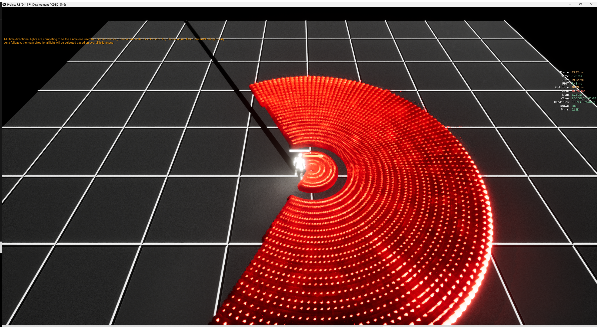
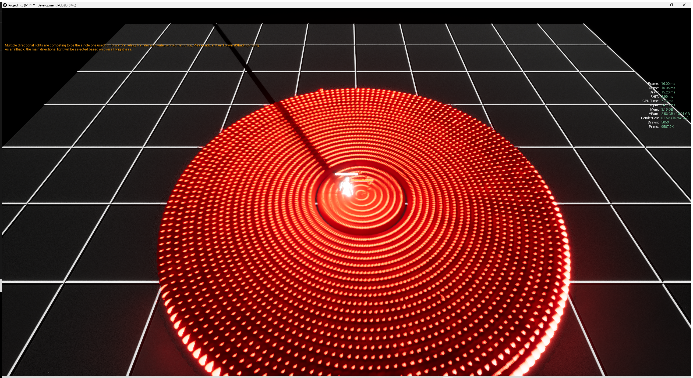
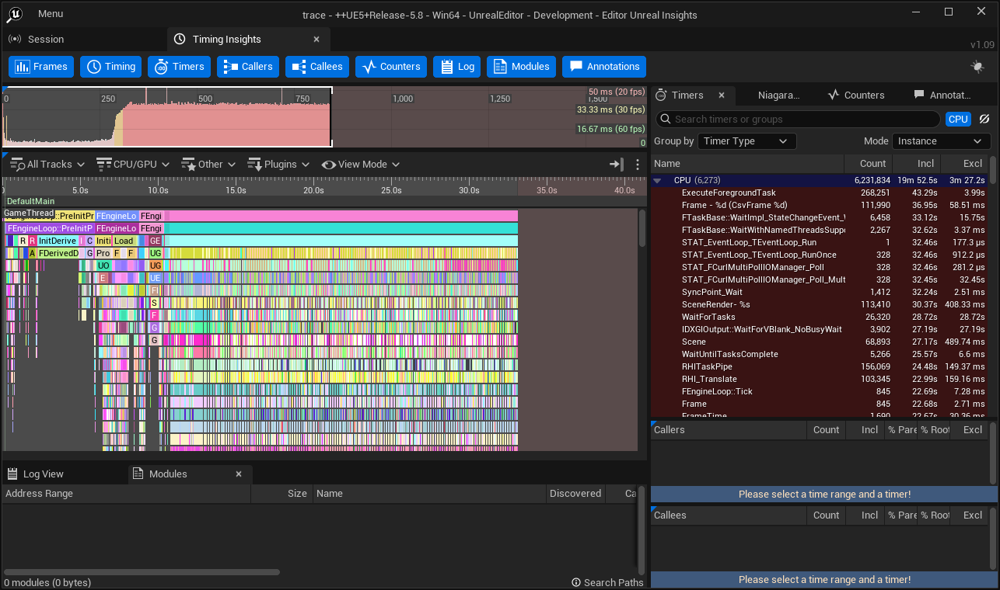
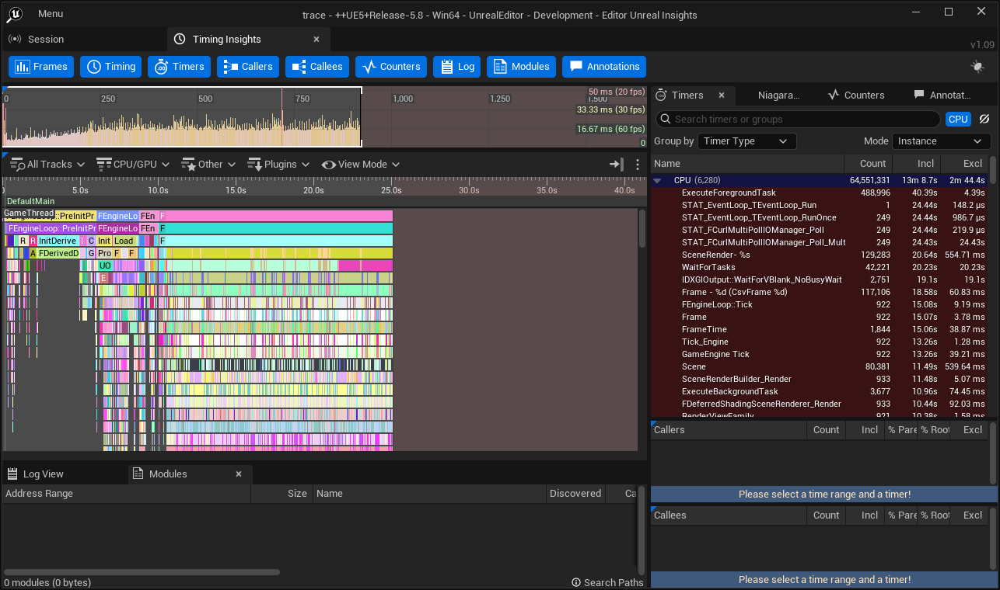

# M3 — Mass vs Actor 스케일 프로파일 리포트

**측정일:** 2026-07-16 · **엔진:** UE 5.8 · **빌드:** `UnrealEditor.exe -game` (Development)
**하네스:** `scripts/profile.ps1` · **조건 고정:** `docs/guides/profiling.md`

> 한 줄 결론: **탄환을 100 → 5000으로 올려도 Mass는 게임 스레드가 평평(2.8 → 4.0 ms)하지만 Actor는 선형으로 무너진다(2.8 → 15.9 ms). 드로우콜은 Mass 386 vs Actor 5053. 이것이 "왜 Mass를 썼나"의 숫자다.**

---

## 0. 읽기 전에 — 이 비교의 통제 범위

측정을 유효하게 만들기 위해 이번 이슈에서 하네스를 세 군데 고쳤다(§5). 그 과정에서 **두 경로의 렌더 셋업이 통제돼 있지 않다**는 것을 발견했다:

| | Mass (ISM) | Actor |
|---|---|---|
| 메시 | 엔진 저폴리 구 | 엔진 **고폴리** 구 |
| 5000발 삼각형 수 | **52.8K** | **9.6M** |
| 탄환 화면 크기 / bloom | 큼 / 강함 | 작음 / 약함 |

→ **총 프레임타임·GPU 시간은 아키텍처(Mass vs Actor)가 아니라 이 렌더 차이가 지배한다.** 두 경로를 공정하게 가르는 축은 **게임 스레드 시간**과 **드로우콜 수**다. 결론은 그 두 축으로 낸다. (렌더 통제 재측정은 범위 밖 — 렌더는 M6에서 Niagara로 교체될 플레이스홀더다. §6 후속 이슈.)

---

## 1. 측정표 (6회, 워밍업 120프레임 제외 · 측정 600프레임)

`re.Bullets.Count`(Mass) / `re.ActorBullets.Count`(Actor)를 노브로 100/1000/5000 지정. **"실제 유지"는 `run.log`의 정상상태 중앙값** — Mass 오픈루프 스폰이 목표에 못 미친다(§6).

| 경로 | 노브 | 실제 유지 | Frame mean | Frame p99 | **GameThread** | RenderThread | GPU |
|---|---:|---:|---:|---:|---:|---:|---:|
| Mass  | 100  | 57   | 4.95  | 6.79  | **2.75**  | 4.95  | 3.85 |
| Mass  | 1000 | 660  | 8.88  | 13.71 | **3.26**  | 8.87  | 7.88 |
| Mass  | 5000 | 3352 | 28.21 | 40.00 | **3.97**  | 28.20 | 27.25 |
| Actor | 100  | 100  | 4.92  | 6.58  | **2.81**  | 4.90  | 3.85 |
| Actor | 1000 | 1000 | 6.45  | 10.76 | **5.34**  | 6.36  | 4.21 |
| Actor | 5000 | 5000 | 16.39 | 26.98 | **15.94** | 14.88 | 5.91 |

(단위 ms. 컬럼은 엔진 CSV 프로파일러 `frames.csv` 실측.)

### 게임 스레드 — 이 리포트의 핵심

```
탄환 수 →      100     1000     5000(급)
Mass GT        2.75     3.26     3.97     ← 거의 평평
Actor GT       2.81     5.34    15.94     ← 선형 붕괴
```

Mass는 탄환이 90배 늘어도 게임 스레드가 1.2 ms만 오른다. Actor는 같은 구간에서 13 ms 오른다. **5000급에서 게임 스레드 4배(3.97 vs 15.94 ms) 차이.** Actor 5000은 프레임이 GT에 완전히 묶였다(GT 15.94 ≈ Frame 16.39).

---

## 2. 프로세서 3분해 (Mass, CSV 컬럼)

`RE_BulletSim/Render/Hit` 스코프에 `CSV_SCOPED_TIMING_STAT` 계측(§5). 컬럼 이름 자체가 **스레드 배치의 증거**다:

| CSV 컬럼 | 스레드 | Mass 5000 mean | p99 |
|---|---|---:|---:|
| `REBullet/AllWorkers/BulletSim`   | **워커 스레드** | 0.03 | 0.06 |
| `REBullet/GameThread/BulletRender`| 게임 스레드 | 0.51 | 0.93 |
| `REBullet/GameThread/BulletHit`   | 게임 스레드 | 0.07 | 0.16 |

**3개 프로세서 총합 = 0.61 ms.** 5000급 부하에서 Mass 탄막 시뮬 자체는 프레임의 ~2%다. 이동(Sim)은 워커 스레드로 완전히 빠졌다 — 게임 스레드가 비어 있는 이유.

---

## 3. 드로우콜 — ISM 배칭 (stat unit @ 5000)

| | Mass 5000 | Actor 5000 |
|---|---:|---:|
| **Draws** | **386** | **5053** |
| Prims | 52.8K | 9.6M |

Mass ISM은 인스턴스 수천 개를 한 줌의 드로우콜로 묶는다. Actor는 탄환 1개당 드로우콜 1개. **드로우콜 13배 차이** — 게임 스레드/RHI 부담의 아키텍처적 근거.

---

## 4. 스크린샷

| Mass 5000 | Actor 5000 |
|---|---|
|  |  |
|  |  |

Insights 상단 프레임 스트립: Mass는 균일한 ~40 ms 블록(GPU 바운드), Actor는 스파이키한 ~16 ms(게임 스레드 `Tick_Engine` 39 ms 지배).

---

## 5. 게이트 판정 & 병목 지목

- **게이트("Mass 5000 평균 frame time ≤ 16.6 ms"): 총 프레임타임 28.21 ms로 미달.**
- 단, 병목은 **Mass 프로세서(0.61 ms)가 아니다.** 분해가 지목하는 병목은 **플레이스홀더 ISM 렌더의 GPU(27.25 ms)** — 저폴리(52.8K prim)인데도 큰 탄환 + 강한 emissive/bloom에 의한 오버드로우/필 바운드.
- 이슈 #46의 "미달 시" 규약대로 **이 이슈에서 최적화하지 않고** 별도 이슈로 분리한다(§6).
- 게임 스레드/CPU 관점 목표는 통과: Mass 5000급 GT 3.97 ms (60fps 예산 16.6 ms의 24%).

## 6. 후속 이슈 (측정으로 지목)

1. **#50 ISM 렌더 GPU 최적화** (M6) — Mass 5000 병목 = GPU 27 ms. bloom/탄환 크기/HISM 컬링/머티리얼 검토. M6 Niagara 렌더가 근본 대체.
2. **#51 Mass 스폰 언더슛** (M3) — 오픈루프 `MakeSpiralForLiveCount`가 목표 5000 → 실제 3352(원점 근처 갓 스폰 탄이 히트 판정에 소멸). Actor식 클로즈드루프(라이브 카운트 피드백)로 교정.

---

## 7. 재현

```powershell
scripts/profile.ps1 -Bullets 100          # Mass
scripts/profile.ps1 -Bullets 1000
scripts/profile.ps1 -Bullets 5000
scripts/profile.ps1 -Bullets 100  -Actor  # Actor 베이스라인
scripts/profile.ps1 -Bullets 1000 -Actor
scripts/profile.ps1 -Bullets 5000 -Actor
```

산출물: `Saved/Profiling/RE_<경로>_<노브>_<스탬프>/` → `frames.csv`(프레임별 ms + 프로세서 분해), `trace.utrace`(Insights), `run.log`(실제 유지 탄환 수).

측정 조건(실 RHI `-windowed 1280x720`, 워밍업 120 컷, `re.Profiling.KeepFiring 1`)은 `docs/guides/profiling.md` 참조.
